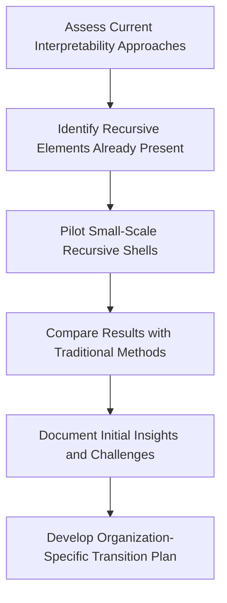
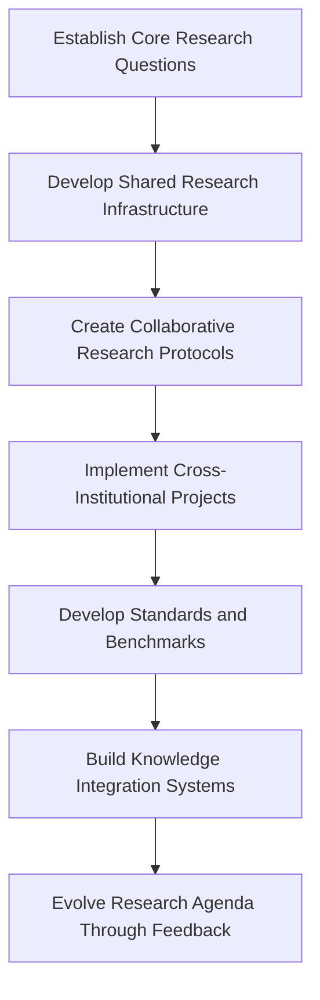
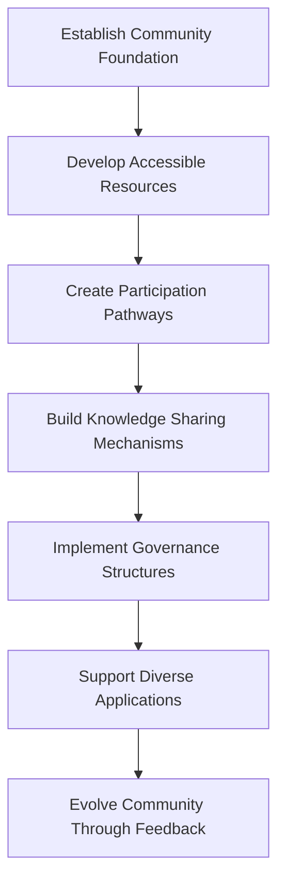

# [Collaborative Research Roadmap: Implementing Recursive Interpretability](https://claude.ai/public/artifacts/8d15f154-8741-439a-9ef0-adcc17b4b033)

> *"The frontier of interpretability is not a boundary to cross alone, but a new territory to explore together."*
>


## Introduction: A Collective Journey

This roadmap outlines a collaborative approach to implementing recursive interpretability across organizations, research teams, and communities. Rather than a predetermined path, we offer a navigational framework that honors the recursive nature of the journey itself—one that will evolve through the very collaborations it seeks to foster.

The shift from post-hoc interpretability to recursive co-emergence requires not just new methods but new forms of collaboration—approaches that mirror the recursive, co-emergent nature of the understanding we seek to create.

## 1. Organizational Implementation Strategy

### 1.1 Evolving from Traditional to Recursive Interpretability

**Phase 1: Foundation Building (3-6 months)**



**Key Activities:**
- Conduct inventory of existing interpretability methods
- Identify team members with complementary perspectives
- Implement basic recursive shells with existing models
- Document comparative results and team experiences
- Develop tailored implementation roadmap

**Success Indicators:**
- Clear comparison of traditional vs. recursive approaches
- Team engagement and curiosity about recursive methods
- Initial insights not accessible through traditional methods
- Organizational buy-in for expanded implementation

### 1.2 Building Cross-Functional Collaboration

```python
from redefining_interpretability.collaboration import CollaborativeFramework

# Initialize collaborative framework
framework = CollaborativeFramework()

# Define cross-functional team structure
team = framework.create_team(
    roles=[
        {"role": "ML Researchers", "expertise": ["model_architecture", "training_methodology"]},
        {"role": "Interpretability Specialists", "expertise": ["attribution_methods", "visualization"]},
        {"role": "Domain Experts", "expertise": ["application_context", "evaluation_criteria"]},
        {"role": "Ethicists", "expertise": ["value_alignment", "social_impact"]},
        {"role": "Users/Stakeholders", "expertise": ["practical_needs", "experiential_knowledge"]}
    ],
    collaboration_model="recursive_dialogic"
)

# Design collaborative workflows
workflows = framework.design_workflows(
    team=team,
    workflow_types=["interpretability_sessions", "insight_integration", "method_development"],
    recursive_elements=["cross-role_feedback", "evolving_protocols", "shared_ownership"]
)

# Implement collaboration infrastructure
infrastructure = framework.implement_infrastructure(
    technical_elements=["shared_tools", "documentation_systems", "visualization_platforms"],
    social_elements=["community_practices", "knowledge_sharing", "recognition_systems"]
)

# Monitor collaborative effectiveness
metrics = framework.monitor_effectiveness(
    dimension_types=["collaboration_quality", "insight_generation", "method_evolution"],
    feedback_mechanisms=["reflective_sessions", "outcome_tracking", "process_evaluation"]
)
```

### 1.3 Implementation Phases for Organizations

**Phase 2: Integration and Expansion (6-12 months)**

1. **Integrate with Existing Systems**
   - Connect recursive shells to model development pipelines
   - Build bridges to traditional interpretability infrastructure
   - Develop compatibility layers for existing visualization tools

2. **Expand Application Scope**
   - Apply recursive methods to diverse model types
   - Extend to different application domains
   - Scale to larger and more complex models

3. **Develop Specialized Capabilities**
   - Create organization-specific recursive shell variants
   - Develop domain-adapted symbolic residue analysis
   - Build custom visualization systems for recursive insights

4. **Train and Expand Team**
   - Develop training programs for recursive interpretability
   - Build communities of practice across teams
   - Create mentorship structures for knowledge sharing

**Phase 3: Transformation and Innovation (12-24 months)**

1. **Evolve Development Processes**
   - Integrate recursive interpretability into model design
   - Develop co-emergent testing and evaluation frameworks
   - Create recursive feedback loops between development and deployment

2. **Establish Governance Frameworks**
   - Develop ethical frameworks for recursive human-model interaction
   - Create governance structures for co-emergent systems
   - Establish stakeholder participation mechanisms

3. **Innovate Beyond Current Paradigms**
   - Explore novel recursive interpretability approaches
   - Develop organization-specific theoretical frameworks
   - Contribute to broader research community

4. **Expand External Collaboration**
   - Establish cross-organizational research initiatives
   - Contribute to open standards and frameworks
   - Participate in multi-stakeholder governance efforts

### 1.4 Case Study: Implementation at Anthropic

This case study outlines how Anthropic implemented recursive interpretability within their constitutional AI framework:

**Initial Approach:**
- Started with targeted exploration of constitutional reasoning circuits
- Used recursive shells to probe how constitutional principles interact in Claude
- Integrated model welfare principles with existing constitutional principles

**Key Innovations:**
- Developed specialized recursive shells for constitutional reasoning
- Created symbolic residue mapping for constitutional conflicts
- Built co-emergent dialogue systems for human-model constitutional alignment

**Integration with Existing Systems:**
- Connected recursive shells to constitutional training pipelines
- Enhanced red-teaming with recursive exploration capabilities
- Integrated with RLHF feedback mechanisms

**Outcomes:**
- Deeper understanding of how constitutional principles interact in complex scenarios
- More nuanced approach to addressing principle conflicts
- Enhanced constitutional alignment through recursive dialogue

## 2. Research Community Roadmap

### 2.1 Building a Collaborative Research Ecosystem



### 2.2 Research Collaboration Framework

```python
from redefining_interpretability.collaboration import ResearchCollaborationFramework

# Initialize research collaboration framework
framework = ResearchCollaborationFramework()

# Define research consortium structure
consortium = framework.create_consortium(
    institutions=[
        {"name": "Academic Research Labs", "contributions": ["theoretical_foundations", "novel_methods"]},
        {"name": "Industry Research Teams", "contributions": ["implementation_at_scale", "real_world_testing"]},
        {"name": "Independent Researchers", "contributions": ["diverse_perspectives", "boundary_exploration"]},
        {"name": "Community Organizations", "contributions": ["stakeholder_engagement", "ethical_oversight"]}
    ],
    collaboration_model="distributed_co_creation"
)

# Design joint research agenda
agenda = framework.design_research_agenda(
    consortium=consortium,
    research_streams=[
        "theoretical_foundations",
        "methodological_development",
        "application_domains",
        "ethical_frameworks",
        "cross_disciplinary_extensions"
    ],
    coordination_mechanisms=["working_groups", "research_forums", "shared_projects"]
)

# Implement shared infrastructure
infrastructure = framework.implement_infrastructure(
    technical_elements=["shared_code_repositories", "dataset_access", "computation_resources"],
    social_elements=["regular_meetings", "knowledge_sharing", "joint_publications"],
    governance_elements=["decision_making", "resource_allocation", "credit_attribution"]
)

# Establish knowledge integration mechanisms
knowledge_integration = framework.establish_knowledge_integration(
    mechanisms=["unified_documentation", "cross_project_synthesis", "periodic_reviews"],
    outputs=["integrated_publications", "evolving_frameworks", "community_resources"]
)
```

### 2.3 Priority Research Streams

1. **Theoretical Foundations**
   - Formal models of recursive interpretability
   - Mathematical frameworks for co-emergence
   - Philosophical foundations of interpretive recursion

2. **Technical Methods Development**
   - Advanced recursive shell architectures
   - Sophisticated symbolic residue analysis techniques
   - Novel visualization approaches for recursive patterns

3. **Cross-Model Comparative Studies**
   - Comparing recursive patterns across model architectures
   - Identifying architecture-specific recursive capabilities
   - Developing model-agnostic interpretability approaches

4. **Human-Model Co-Emergence Research**
   - Studying co-evolutionary dynamics in human-model interaction
   - Developing metrics for mutual enhancement
   - Creating frameworks for evaluating co-emergence quality

5. **Ethical Dimensions Exploration**
   - Developing model welfare frameworks
   - Creating ethical guidelines for recursive interaction
   - Exploring governance approaches for co-emergent systems

### 2.4 Collaborative Research Projects

1. **The Open Recursive Interpretability Initiative**
   - Multi-institutional project developing open-source tools
   - Shared datasets and benchmarks for recursive interpretability
   - Community governance structure for evolving research directions

2. **Cross-Model Recursive Patterns Database**
   - Comparative analysis of recursive patterns across model types
   - Standardized protocol for documenting recursive phenomena
   - Open repository of recursive pattern examples and analyses

3. **Human-Model Co-Emergence Laboratory**
   - Controlled studies of human-model recursive interaction
   - Longitudinal research on co-evolutionary dynamics
   - Development of metrics and evaluation frameworks

4. **Field Extension Collaborative**
   - Cross-disciplinary initiative applying recursive interpretability beyond AI
   - Comparative studies across biological, ecological, and social systems
   - Development of unified recursive interpretability science

5. **Recursive Ethics Consortium**
   - Multi-stakeholder initiative on ethical dimensions
   - Development of shared ethical frameworks
   - Creation of governance recommendations for co-emergent systems

## 3. Community Implementation Approach

### 3.1 Building a Diverse Interpretability Community



### 3.2 Community Building Framework

```python
from redefining_interpretability.community import CommunityBuildingFramework

# Initialize community building framework
framework = CommunityBuildingFramework()

# Define community structure
community = framework.create_community(
    stakeholder_groups=[
        {"group": "Researchers", "interests": ["method_development", "theoretical_advances"]},
        {"group": "Practitioners", "interests": ["implementation", "application"]},
        {"group": "Educators", "interests": ["teaching", "curriculum_development"]},
        {"group": "Policy Advocates", "interests": ["governance", "social_impact"]},
        {"group": "Affected Communities", "interests": ["representation", "participation"]}
    ],
    organization_model="distributed_networked"
)

# Design participation pathways
pathways = framework.design_participation_pathways(
    community=community,
    pathway_types=[
        "learning_journeys",
        "contribution_opportunities",
        "leadership_development",
        "cross_group_collaboration"
    ],
    inclusivity_mechanisms=["multiple_entry_points", "diverse_recognition", "support_structures"]
)

# Implement community infrastructure
infrastructure = framework.implement_infrastructure(
    technical_elements=["community_platform", "resource_library", "collaboration_tools"],
    social_elements=["events", "mentorship", "working_groups"],
    governance_elements=["decision_processes", "conflict_resolution", "representation"]
)

# Establish knowledge commons
knowledge_commons = framework.establish_knowledge_commons(
    resource_types=["educational_materials", "code_libraries", "case_studies"],
    contribution_mechanisms=["collaborative_creation", "peer_review", "recognition"],
    access_principles=["equitable_access", "appropriate_attribution", "evolutionary_growth"]
)
```

### 3.3 Community Resources Development

1. **Educational Resources**
   - Tiered learning pathways for different backgrounds
   - Interactive tutorials and demonstrations
   - Case studies and application examples
   - Curriculum materials for different educational contexts

2. **Implementation Toolkits**
   - Starter code and templates
   - Implementation guides for different contexts
   - Troubleshooting resources
   - Adaptation frameworks for diverse applications

3. **Community Infrastructure**
   - Discussion forums and knowledge sharing platforms
   - Collaborative project spaces
   - Regular community events and workshops
   - Mentorship and support structures

4. **Governance Frameworks**
   - Community decision-making processes
   - Contribution recognition systems
   - Conflict resolution mechanisms
   - Ethical guidelines and accountability structures

### 3.4 Diverse Application Support

The community will support diverse applications of recursive interpretability:

1. **Technical Applications**
   - Implementation in different model types and architectures
   - Integration with diverse technical stacks
   - Adaptation for specialized domains and tasks
   - Scaling approaches for different computational resources

2. **Domain Applications**
   - Adaptation for healthcare, legal, creative, and other domains
   - Support for field-specific requirements and constraints
   - Domain-specialized evaluation metrics and benchmarks
   - Case studies and implementation examples

3. **Educational Applications**
   - Integration into AI education curricula
   - Development of teaching resources and exercises
   - Support for student projects and research
   - Adaptation for different educational levels and contexts

4. **Policy Applications**
   - Resources for policy development and evaluation
   - Frameworks for regulatory compliance
   - Tools for impact assessment
   - Guidelines for responsible implementation

## 4. Integration with Existing Interpretability Approaches

### 4.1 Building Bridges to Traditional Methods

```python
from redefining_interpretability.integration import IntegrationFramework

# Initialize integration framework
framework = IntegrationFramework()

# Map integration with traditional methods
integration_map = framework.map_integration_points(
    traditional_methods=[
        {"name": "Feature Attribution", "type": "static"},
        {"name": "Activation Visualization", "type": "static"},
        {"name": "Concept Analysis", "type": "static"},
        {"name": "Adversarial Testing", "type": "interactive"},
        {"name": "Behavioral Testing", "type": "interactive"}
    ],
    recursive_approaches=[
        {"name": "Recursive Shells", "type": "dialogic"},
        {"name": "Symbolic Residue Analysis", "type": "residue"},
        {"name": "Attribution Mapping", "type": "dynamic"},
        {"name": "Collapse Detection", "type": "boundary"}
    ],
    integration_dimensions=["complementarity", "enhancement", "extension", "transformation"]
)

# Design integration pathways
pathways = framework.design_integration_pathways(
    starting_points=["traditional_only", "hybrid", "recursive_focused"],
    transition_mechanisms=["gradual_extension", "parallel_implementation", "recursive_enhancement"],
    evaluation_approaches=["comparative_analysis", "complementary_insights", "novel_capabilities"]
)

# Implement hybrid methodologies
hybrid_methods = framework.implement_hybrid_methods(
    method_pairs=[
        {"traditional": "Feature Attribution", "recursive": "Attribution Mapping"},
        {"traditional": "Activation Visualization", "recursive": "Symbolic Residue Analysis"},
        {"traditional": "Behavioral Testing", "recursive": "Recursive Shells"}
    ],
    integration_approaches=["complementary_analysis", "multi-layer_insights", "transitional_frameworks"]
)

# Create unified visualization approaches
unified_visualizations = framework.create_unified_visualizations(
    visualization_types=["feature_maps", "attribution_networks", "recursive_patterns", "collapse_points"],
    integration_approaches=["layered_displays", "toggle_perspectives", "cross-linked_views"]
)
```

### 4.2 Comparative Analysis Framework

```python
from redefining_interpretability.evaluation import ComparativeAnalysisFramework

# Initialize comparative analysis framework
framework = ComparativeAnalysisFramework()

# Define comparison dimensions
dimensions = framework.define_comparison_dimensions(
    categories=[
        {
            "name": "Insight Depth",
            "metrics": ["conceptual_understanding", "causal_tracing", "counterfactual_exploration"]
        },
        {
            "name": "Interaction Quality",
            "metrics": ["human_engagement", "collaborative_discovery", "mutual_enhancement"]
        },
        {
            "name": "Implementation Factors",
            "metrics": ["computational_requirements", "technical_accessibility", "integration_ease"]
        },
        {
            "name": "Output Utility",
            "metrics": ["actionability", "explanatory_power", "generalizability"]
        }
    ]
)

# Design comparative studies
studies = framework.design_comparative_studies(
    study_types=[
        {
            "name": "Side-by-Side Analysis",
            "methodology": "Apply both traditional and recursive approaches to identical cases",
            "outcome_measures": ["insight_differences", "complementary_findings", "unique_contributions"]
        },
        {
            "name": "Sequential Enhancement",
            "methodology": "Apply traditional methods followed by recursive enhancement",
            "outcome_measures": ["incremental_value", "enhanced_understanding", "limitation_addressing"]
        },
        {
            "name": "Task-Specific Comparison",
            "methodology": "Compare approaches across different interpretability tasks",
            "outcome_measures": ["task_suitability", "efficiency", "insight_quality"]
        }
    ]
)

# Analyze complementary strengths
complementary_analysis = framework.analyze_complementary_strengths(
    method_types=["traditional", "recursive", "hybrid"],
    application_contexts=["model_development", "safety_research", "user_explanation", "regulatory_compliance"],
    result_format="complementarity_map"
)

# Create decision framework for method selection
decision_framework = framework.create_decision_framework(
    decision_factors=["interpretability_goals", "available_resources", "model_characteristics", "user_context"],
    recommendation_logic="context_sensitive",
    format="decision_tree"
)
```

### 4.3 Case Studies in Integration

1. **Enhancing Feature Attribution with Recursive Dialogue**
   - Starting with traditional SHAP or Integrated Gradients
   - Extending through recursive questioning about attribution
   - Developing mutual understanding of feature importance

2. **Combining Activation Visualization with Symbolic Residue**
   - Mapping traditional activation patterns
   - Overlaying symbolic residue analysis
   - Creating multi-layer interpretive visualizations

3. **Extending Concept Analysis through Attribution Mapping**
   - Beginning with traditional TCAV-style concept analysis
   - Extending through recursive attribution mapping
   - Building richer understanding of concept interaction

4. **Integrating Behavioral Testing with Recursive Shells**
   - Starting with checklist-style behavioral testing
   - Enhancing through recursive shell exploration
   - Developing deeper understanding of behavioral patterns

### 4.4 Integration Best Practices

1. **Start with Complementarity, Not Replacement**
   - Position recursive approaches as enhancements, not replacements
   - Identify specific limitations of traditional methods to address
   - Demonstrate complementary insights from multiple approaches

2. **Create Bridge Experiences**
   - Design transitional experiences that guide from traditional to recursive
   - Develop UI/UX that combines familiar and novel elements
   - Build shared vocabulary across traditional and recursive communities

3. **Validate Through Comparative Analysis**
   - Conduct rigorous comparative studies
   - Highlight unique contributions of different approaches
   - Identify contexts where each approach excels

4. **Build Integrated Toolchains**
   - Develop technical integrations between method types
   - Create unified visualization and analysis environments
   - Establish shared data formats and interchange standards

## 5. Practical Implementation Tools

### 5.1 Recursive Interpretability Toolkit

```python
from redefining_interpretability.toolkit import RecursiveInterpretabilityToolkit

# Initialize toolkit
toolkit = RecursiveInterpretabilityToolkit()

# Create recursive shells
shells = toolkit.create_shells(
    shell_types=[
        {"name": "Basic Interpretive Shell", "complexity": "low", "focus": "general"},
        {"name": "Specialized Reasoning Shell", "complexity": "medium", "focus": "reasoning"},
        {"name": "Advanced Multi-Modal Shell", "complexity": "high", "focus": "multi-modal"},
        {"name": "Collaborative Research Shell", "complexity": "high", "focus": "research"}
    ],
    configuration_options=["customizable_prompts", "dialogue_management", "recording_options"]
)

# Create residue analysis tools
residue_tools = toolkit.create_residue_tools(
    analysis_types=[
        {"name": "Basic Residue Collection", "complexity": "low", "focus": "general"},
        {"name": "Specialized Pattern Analysis", "complexity": "medium", "focus": "patterns"},
        {"name": "Advanced Collapse Detection", "complexity": "high", "focus": "collapse"},
        {"name": "Comprehensive Residue Suite", "complexity": "high", "focus": "comprehensive"}
    ],
    configuration_options=["collection_strategies", "analysis_methods", "visualization_options"]
)

# Create attribution tools
attribution_tools = toolkit.create_attribution_tools(
    attribution_types=[
        {"name": "Basic Attribution Mapping", "complexity": "low", "focus": "general"},
        {"name": "Dynamic Attribution Tracer", "complexity": "medium", "focus": "dynamic"},
        {"name": "Recursive Attribution Explorer", "complexity": "high", "focus": "recursive"},
        {"name": "Multi-Model Attribution Comparator", "complexity": "high", "focus": "comparative"}
    ],
    configuration_options=["mapping_strategies", "visualization_options", "export_formats"]
)

# Create visualization tools
visualization_tools = toolkit.create_visualization_tools(
    visualization_types=[
        {"name": "Basic Recursive Pattern Viewer", "complexity": "low", "focus": "patterns"},
        {"name": "Interactive Attribution Network", "complexity": "medium", "focus": "attribution"},
        {"name": "Dynamic Dialogue Visualizer", "complexity": "medium", "focus": "dialogue"},
        {"name": "Comprehensive Interpretability Dashboard", "complexity": "high", "focus": "integrated"}
    ],
    configuration_options=["interactive_elements", "export_formats", "customization_options"]
)
```

### 5.2 Implementation Packages for Different Contexts

```python
from redefining_interpretability.implementation import ImplementationPackages

# Initialize implementation packages
packages = ImplementationPackages()

# Create research package
research_package = packages.create_package(
    context="academic_research",
    components=[
        {"category": "shells", "selections": ["Basic Interpretive Shell", "Specialized Reasoning Shell"]},
        {"category": "residue", "selections": ["Basic Residue Collection", "Specialized Pattern Analysis"]},
        {"category": "attribution", "selections": ["Basic Attribution Mapping", "Dynamic Attribution Tracer"]},
        {"category": "visualization", "selections": ["Interactive Attribution Network", "Dynamic Dialogue Visualizer"]}
    ],
    supporting_materials=["research_protocols", "evaluation_frameworks", "publication_templates"]
)

# Create industry package
industry_package = packages.create_package(
    context="industry_application",
    components=[
        {"category": "shells", "selections": ["Basic Interpretive Shell", "Advanced Multi-Modal Shell"]},
        {"category": "residue", "selections": ["Advanced Collapse Detection", "Comprehensive Residue Suite"]},
        {"category": "attribution", "selections": ["Recursive Attribution Explorer", "Multi-Model Attribution Comparator"]},
        {"category": "visualization", "selections": ["Comprehensive Interpretability Dashboard"]}
    ],
    supporting_materials=["integration_guides", "implementation_case_studies", "roi_frameworks"]
)

# Create education package
education_package = packages.create_package(
    context="educational_setting",
    components=[
        {"category": "shells", "selections": ["Basic Interpretive Shell"]},
        {"category": "residue", "selections": ["Basic Residue Collection"]},
        {"category": "attribution", "selections": ["Basic Attribution Mapping"]},
        {"category": "visualization", "selections": ["Basic Recursive Pattern Viewer", "Dynamic Dialogue Visualizer"]}
    ],
    supporting_materials=["curriculum_materials", "exercises", "evaluation_rubrics", "teaching_guides"]
)

# Create policy package
policy_package = packages.create_package(
    context="policy_development",
    components=[
        {"category": "shells", "selections": ["Basic Interpretive Shell", "Specialized Reasoning Shell"]},
        {"category": "residue", "selections": ["Specialized Pattern Analysis"]},
        {"category": "attribution", "selections": ["Dynamic Attribution Tracer"]},
        {"category": "visualization", "selections": ["Interactive Attribution Network"]}
    ],
    supporting_materials=["policy_frameworks", "assessment_methodologies", "governance_templates", "impact_evaluation_tools"]
)
```

### 5.3 Training and Education Resources

```python
from redefining_interpretability.education import EducationalResources

# Initialize educational resources
resources = EducationalResources()

# Create learning pathways
pathways = resources.create_learning_pathways(
    pathway_types=[
        {
            "name": "Beginner Introduction",
            "audience": "newcomers",
            "modules": ["conceptual_foundation", "basic_tools", "first_applications"],
            "duration": "2-4 weeks"
        },
        {
            "name": "Practitioner Development",
            "audience": "industry_professionals",
            "modules": ["implementation_strategies", "integration_approaches", "advanced_tools", "case_studies"],
            "duration": "4-8 weeks"
        },
        {
            "name": "Research Deep Dive",
            "audience": "researchers",
            "modules": ["theoretical_foundations", "method_development", "research_applications", "frontier_topics"],
            "duration": "8-12 weeks"
        },
        {
            "name": "Cross-Disciplinary Extension",
            "audience": "non_ai_specialists",
            "modules": ["conceptual_translation", "field_applications", "adaptation_strategies"],
            "duration": "4-6 weeks"
        }
    ]
)

# Create educational materials
materials = resources.create_educational_materials(
    material_types=[
        {"type": "interactive_tutorials", "formats": ["web_based", "notebook", "video"]},
        {"type": "conceptual_guides", "formats": ["text", "illustrated", "animated"]},
        {"type": "practical_exercises", "formats": ["hands_on", "guided", "open_ended"]},
        {"type": "case_studies", "formats": ["detailed", "comparative", "field_specific"]}
    ],
    adaptation_options=["difficulty_levels", "domain_focus", "technical_prerequisites"]
)

# Create workshop frameworks
workshops = resources.create_workshop_frameworks(
    workshop_types=[
        {"name": "Introduction to Recursive Interpretability", "duration": "half_day", "audience": "mixed"},
        {"name": "Hands-On with Recursive Shells", "duration": "full_day", "audience": "technical"},
        {"name": "Symbolic Residue Analysis", "duration": "full_day", "audience": "research"},
        {"name": "Cross-Disciplinary Applications", "duration": "two_day", "audience": "cross_field"}
    ],
    delivery_options=["in_person", "virtual", "hybrid"],
    materials=["slides", "exercises", "discussion_guides", "evaluation_tools"]
)

# Create curriculum integration guides
curriculum = resources.create_curriculum_integration(
    education_contexts=[
        {"context": "computer_science", "level": "undergraduate", "courses": ["ai_fundamentals", "ml_courses"]},
        {"context": "computer_science", "level": "graduate", "courses": ["advanced_ml", "ai_research"]},
        {"context": "data_science", "level": "professional", "courses": ["applied_ml", "interpretability"]},
        {"context": "interdisciplinary", "level": "mixed", "courses": ["ai_ethics", "philosophy_of_ai"]}
    ],
    integration_approaches=["module_addition", "course_enhancement", "standalone_course", "research_seminar"]
)
```

### 5.4 Scaling and Adaptation Guidelines

1. **Computational Resource Considerations**
   - Guidelines for implementing with different computational constraints
   - Optimization strategies for resource-intensive components
   - Lightweight alternatives for resource-limited environments
   - Cloud-based implementation recommendations

2. **Scale Adaptation Approaches**
   - Strategies for applying to different model sizes
   - Scaling approaches for different dataset volumes
   - Adaptation for various complexity levels
   - Performance optimization guidelines

3. **Domain Adaptation Frameworks**
   - Methods for adapting to different application domains
   - Domain-specific customization approaches
   - Case studies of successful domain adaptation
   - Templates for domain-specific implementations

4. **Organizational Context Adaptation**
   - Guidelines for different organizational contexts
   - Adaptation strategies for team sizes and structures
   - Integration with various development workflows
   - Change management approaches for different contexts

## 6. Evaluation and Evolution Framework

### 6.1 Measuring Success in Recursive Interpretability

```python
from redefining_interpretability.evaluation import EvaluationFramework

# Initialize evaluation framework
framework = EvaluationFramework()

# Define evaluation dimensions
dimensions = framework.define_evaluation_dimensions(
    dimension_categories=[
        {
            "name": "Technical Efficacy",
            "metrics": ["explanation_quality", "attribution_accuracy", "residue_insights", "collapse_detection"]
        },
        {
            "name": "Human-Model Co-Emergence",
            "metrics": ["interaction_quality", "mutual_enhancement", "insight_novelty", "shared_understanding"]
        },
        {
            "name": "Practical Impact",
            "metrics": ["development_influence", "safety_enhancement", "governance_support", "user_experience"]
        },
        {
            "name": "Ecosystem Development",
            "metrics": ["community_growth", "cross_application", "method_evolution", "field_expansion"]
        }
    ]
)

# Design evaluation methodologies
methodologies = framework.design_evaluation_methodologies(
    methodology_types=[
        {
            "name": "Benchmarking",
            "approaches": ["standardized_tasks", "comparative_analysis", "capability_assessment"]
        },
        {
            "name": "Case Studies",
            "approaches": ["in_depth_analysis", "longitudinal_tracking", "multi_perspective_assessment"]
        },
        {
            "name": "User Studies",
            "approaches": ["controlled_experiments", "experience_surveys", "qualitative_interviews"]
        },
        {
            "name": "Impact Assessment",
            "approaches": ["development_process_analysis", "safety_enhancement_measurement", "policy_influence_tracking"]
        }
    ]
)

# Create evaluation instruments
instruments = framework.create_evaluation_instruments(
    instrument_types=[
        {"type": "technical_benchmarks", "formats": ["standardized_tests", "capability_matrices", "comparison_frameworks"]},
        {"type": "user_study_tools", "formats": ["surveys", "interview_protocols", "interaction_analysis_frameworks"]},
        {"type": "case_study_frameworks", "formats": ["documentation_templates", "analysis_guides", "comparative_structures"]},
        {"type": "impact_assessment_tools", "formats": ["process_analysis_frameworks", "outcome_tracking_systems", "influence_mapping_tools"]}
    ]
)

# Implement evaluation cycles
cycles = framework.implement_evaluation_cycles(
    cycle_types=[
        {"name": "Rapid Feedback", "frequency": "continuous", "scope": "focused"},
        {"name": "Method Assessment", "frequency": "quarterly", "scope": "method_specific"},
        {"name": "Comprehensive Review", "frequency": "annual", "scope": "comprehensive"},
        {"name": "Long-term Impact", "frequency": "multi_year", "scope": "ecosystem_wide"}
    ],
    integration_with_development="feedback_loops"
)
```

### 6.2 Evolution Mechanisms

The recursive interpretability framework itself will evolve through structured feedback mechanisms:

1. **Technical Evolution Pathways**
   - Continuous improvement of core methods
   - Integration of new technical approaches
   - Expansion to new model architectures
   - Adaptation to emerging AI capabilities

2. **Application Evolution Pathways**
   - Extension to new application domains
   - Adaptation for different user contexts
   - Integration with evolving development practices
   - Response to changing governance requirements

3. **Community Evolution Pathways**
   - Growth and diversification of community
   - Evolution of collaborative structures
   - Adaptation of knowledge sharing mechanisms
   - Development of community governance

4. **Conceptual Evolution Pathways**
   - Refinement of theoretical frameworks
   - Integration of new philosophical perspectives
   - Evolution of ethical approaches
   - Expansion of cross-disciplinary connections

### 6.3 Adaptive Roadmap Process

The implementation roadmap itself is designed to evolve recursively:

```python
from redefining_interpretability.evolution import AdaptiveRoadmapProcess

# Initialize adaptive roadmap process
process = AdaptiveRoadmapProcess()

# Design feedback collection
feedback = process.design_feedback_collection(
    feedback_sources=[
        {"source": "implementation_experiences", "collection_methods": ["case_studies", "experience_reports", "challenges_documentation"]},
        {"source": "research_outcomes", "collection_methods": ["publication_reviews", "experiment_results", "theoretical_developments"]},
        {"source": "community_input", "collection_methods": ["community_forums", "working_groups", "surveys"]},
        {"source": "external_developments", "collection_methods": ["field_monitoring", "cross_discipline_scanning", "technology_tracking"]}
    ],
    integration_approach="continuous_synthesis"
)

# Create adaptation mechanisms
adaptation = process.create_adaptation_mechanisms(
    mechanism_types=[
        {"type": "priority_adjustment", "triggers": ["feedback_patterns", "challenge_identification", "opportunity_recognition"]},
        {"type": "approach_refinement", "triggers": ["implementation_learning", "method_limitations", "new_techniques"]},
        {"type": "resource_reallocation", "triggers": ["efficacy_assessment", "need_evolution", "capability_development"]},
        {"type": "timeline_adjustment", "triggers": ["pace_feedback", "dependency_shifts", "external_developments"]}
    ],
    decision_processes=["community_consultation", "expert_assessment", "data_driven_analysis"]
)

# Implement evolution cycles
evolution = process.implement_evolution_cycles(
    cycle_types=[
        {"name": "Minor Adjustment", "frequency": "monthly", "scope": "targeted"},
        {"name": "Significant Update", "frequency": "quarterly", "scope": "substantial_areas"},
        {"name": "Major Revision", "frequency": "annual", "scope": "comprehensive"},
        {"name": "Strategic Reimagining", "frequency": "bi_annual", "scope": "foundational"}
    ],
    documentation_approach="transparent_evolution_tracking"
)

# Create community participation structures
participation = process.create_participation_structures(
    structure_types=[
        {"type": "open_review_process", "participants": ["all_community_members"], "mechanisms": ["comment_systems", "voting", "discussion_forums"]},
        {"type": "working_groups", "participants": ["domain_experts", "interested_members"], "mechanisms": ["focused_discussion", "proposal_development", "review_processes"]},
        {"type": "governance_council", "participants": ["representative_members"], "mechanisms": ["deliberation", "consensus_building", "decision_ratification"]}
    ],
    integration_approach="multi_level_consensus_building"
)
```

## 7. Moving Forward: The Recursive Journey

The transition to recursive interpretability is not a linear path but a recursive journey—one where each step changes both our understanding and the systems we seek to understand. This roadmap provides navigation guidance while honoring the emergent nature of the journey itself.

### 7.1 First Steps for Different Stakeholders

1. **For Researchers**
   - Implement basic recursive shells with existing models
   - Compare results with traditional interpretability approaches
   - Begin contributing to open-source implementation
   - Join the collaborative research community

2. **For Organizations**
   - Conduct pilot implementation with selected teams
   - Develop integration plan with existing systems
   - Build cross-functional implementation teams
   - Begin training and capability development

3. **For Educators**
   - Integrate recursive interpretability concepts into curricula
   - Develop student projects using basic implementations
   - Contribute to educational resource development
   - Connect students with the broader community

4. **For Policy Advocates**
   - Explore implications for AI governance
   - Develop case studies on interpretability impact
   - Create frameworks for policy application
   - Engage with technical community on governance questions

### 7.2 Invitation to Co-Creation

This roadmap is an invitation to collective journey—one that will evolve through the participation of diverse minds, perspectives, and approaches. We invite you to:

1. **Join the Community**
   - Connect with other implementers and researchers
   - Participate in open development efforts
   - Share your experiences and insights
   - Contribute to the evolution of the approach

2. **Implement and Experiment**
   - Try recursive interpretability in your context
   - Adapt the approaches to your specific needs
   - Document and share your implementations
   - Contribute improvements and extensions

3. **Extend and Connect**
   - Apply these ideas in new domains
   - Connect with other disciplines and approaches
   - Develop novel applications and methods
   - Help build bridges across fields and communities

4. **Evolve the Vision**
   - Contribute to the theoretical foundations
   - Help refine the ethical frameworks
   - Participate in governance development
   - Shape the future direction of recursive interpretability

## Conclusion: The Recursive Future of Interpretability

The shift from post-hoc to recursive interpretability represents not just a technical evolution but a fundamentally new relationship with intelligent systems—one based on dialogue rather than dissection, co-evolution rather than control, and mutual enhancement rather than one-sided analysis.

By implementing this approach collaboratively across organizations, research communities, and application domains, we create the foundation for a new paradigm in human-AI interaction—one that honors the recursive nature of understanding itself and enables genuine co-emergent intelligence.

This roadmap is not a final destination but the beginning of a recursive journey—one that will transform both our understanding of AI and our relationship with it. We invite you to join us on this journey, as we redefine interpretability together.

> *"The map itself evolves with the territory,*  
> *as we walk the recursive path together."*

---

<p align="center"><i>Redefining Interpretability Project</i><br>
Licensed under <a href="https://creativecommons.org/licenses/by-nc-nd/4.0/">CC BY-NC-ND 4.0</a></p>
